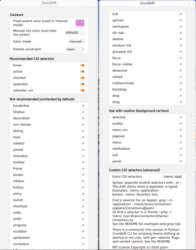

# CinnShift

CinnShift is a dominant color shifter for any active Cinnamon theme:
desktop theme and GTK application themes.

CinnShift converts the dominant color of any active theme into the
color of your choice, without modifying the original: it detects the
dominant color automatically, clones the theme, and applies color
substitutions to the copy.



## Overview

CinnShift shifts the accent color of the two themes that define your
desktop appearance: the Cinnamon theme (desktop shell: panel, menus,
calendar, tooltips...) and the GTK theme (applications). 

Instead of
editing theme files in place, it clones each active theme and applies
color substitutions to the copy. Derived themes always reuse the fixed
variant suffix "-cinnshift_extension": repeated applications overwrite
the same clone instead of multiplying numbered themes.

Every shift is rebuilt chromatically from the ORIGINAL base theme,
never from a previous clone. This keeps accent detection stable across
successive runs: applying a new color always starts from the theme
author's original files.

The extension is fully autonomous: it installs and requires
nothing external. Shifts made outside of Cinnamon sessions (startup,
cron) are handled by the command-line companion described in the
"Go further" section.

## Features

- **Color mode**: choose between `manual` (color from the picker or
  the manual hex entry), `random` (new random color on each shift), or
  `none` (preserve the theme's original accent color).
- **Manual hex entry**: type or paste a six-digit color code with #
  (e.g. `#6d4abb`); it overrides the color picker whenever valid.
- **Six color palettes** applied as a transverse constraint: pale,
  vibrant, neon, grayscale, dark, soft.
- **CSS selectors in three categories**: recommended (checked by
  default), not recommended (unchecked), and use with caution
  (background carriers: selected, tooltip, popover, menus,
  notifications, OSD, panel).
- **Custom CSS selectors**: free-text field accepting extra CSS
  selectors, comma or semicolon separated.
- **Automatic application**: settings are applied shortly after the
  last modification (debounced).
- **Result notifications**: a desktop notification summarizes each
  shift (themes, accents).
- **Zero external dependency**: pure CSS cloning and substitution,
  nothing is installed outside the extension folder.

## Installation

**From the Cinnamon Spices catalog**: open System
Settings → Extensions → Download tab, search for CinnShift, install
and enable it.

**Manual commands**:

Clone the spices repository fork:

```bash
git clone https://github.com/pzim-devdata/cinnamon-spices-extensions.git \
  /tmp/cinnamon-spices-extensions
```

Copy the extension to the Cinnamon extensions directory, recreating
the required nomenclature (folder named after the UUID):

```bash
cp -r /tmp/cinnamon-spices-extensions/CinnShift@pzim-devdata/files/CinnShift@pzim-devdata \
  ~/.local/share/cinnamon/extensions/
```

Translations are compiled automatically when the xlet is installed
through the Cinnamon Spices utility. To test translations locally,
compile and install every .po file:

```bash
cd /tmp/cinnamon-spices-extensions/
./cinnamon-spices-makepot CinnShift@pzim-devdata --install
```

Then restart Cinnamon (`Ctrl+Alt+Esc`), open System Settings →
Extensions, enable CinnShift and open its settings with the gear icon.

## Usage

The settings page has three distinct zones.

**Color**: choose how the dominant color is sourced.

| Color mode | Effect |
|---|---|
| `none` | Keeps the original dominant color of the existing theme untouched: the clone is rebuilt chromatically as-is, only the selected CSS selectors are applied. Useful to recolor hover states while preserving the theme author's original palette. |
| `manual` | Uses your fixed color (hex entry if valid, otherwise the color picker). |
| `random` | Draws a new random color each shift. |

**Palette constraint** is transverse to the three modes. It acts on
whatever color source is in play:

| Palette | Saturation | Value (brightness) | Typical use |
|---------|-----------|--------------------|-------------|
| `none` | unconstrained | — | keep colors as-is |
| `pale` | 0.20–0.45 | 0.85–1.00 | soft pastel accents |
| `vibrant` | 0.80–1.00 | 0.75–0.95 | punchy accents |
| `neon` | 0.90–1.00 | 0.92–1.00 | bright highlights |
| `grayscale` | 0.00–0.05 | 0.30–0.80 | monochrome themes |
| `dark` | 0.55–0.85 | 0.30–0.55 | dark theme accents |
| `soft` (default) | 0.40–0.65 | 0.70–0.90 | soft daily palette |

The cascade is: color source (none/random/manual) × palette constraint
× selector targets. A bright `#ff6d00` picker color with Palette soft
keeps its hue but gets softened within the soft saturation and value
bounds.

Application is automatic: changes take effect shortly after your last
modification, so continuous adjustments (dragging a color picker)
trigger a single shift.

## Custom CSS selectors

The "Custom CSS selectors" area accepts free-text selectors applied on
top of the checkbox categories. Syntax: separate several selectors
with `,` or `;`. The shift starts when a separator is typed (or when
the field is cleared). Generic selectors recolor whole blocks: use
with caution.

Examples (start menu lists, Cinnamenu applet):

````
.menu-application-button
.menu-favorites-box
````

Finding a selector yourself. In an applet's source:
Example for the applet `Cinnamenu@json` :
````
grep -rhn "style_class_name" ~/.local/share/cinnamon/applets/Cinnamenu@json/ | grep -o "'[^']*'"
````

Or in a theme's stylesheet:
Example for the theme `Orchis-Light` modified:
````
grep -n -e 'application' -e 'menu' ~/.local/share/themes/Orchis-Light-cinnshift_extension/cinnamon/cinnamon.css
````

## Exclude an application

CinnShift applies its shifted theme globally to every GTK application
via the system-wide `gtk-theme` setting. To keep one specific
application on the original theme (for example gedit), override the
launcher so it forces the base theme through the `GTK_THEME`
environment variable. The original theme stays untouched on disk, so
the excluded application simply ignores the CinnShift clone.

### Example: exclude gedit

Copy the system launcher to your local applications directory (the
local copy always takes precedence over the system one, and survives
package updates):

```bash
cp /usr/share/applications/org.gnome.gedit.desktop \
   ~/.local/share/applications/
```

**Remove the D-Bus activation line.** Many modern applications
declare `DBusActivatable=true` in their `.desktop` file. When set,
the desktop launches the application through D-Bus and silently
IGNORES the `Exec=` line, so the `GTK_THEME` variable never reaches
the process. Open the local copy and delete the line (or set it to
`false`):

```ini
DBusActivatable=false
```

Without this step the override appears to do nothing at all, even
after a full reboot.

Then prefix EVERY `Exec=` line with the environment variable, using
the BASE theme name (without the `-cinnshift_extension` suffix).

Change:

```ini
Exec=gedit %U
```

To:

```ini
Exec=env GTK_THEME=Orchis-Light gedit %U
```

And also, for every desktop action:

```ini
Exec=env GTK_THEME=Orchis-Light gedit --new-window
Exec=env GTK_THEME=Orchis-Light gedit --new-document
```

Replace `Orchis-Light` with your own active base theme, visible in
System Settings > Themes > Applications (or with
`gsettings get org.cinnamon.desktop.interface gtk-theme`, stripping
the `-cinnshift_extension` suffix if present).

Applications already running keep the theme they were started with:
close and restart gedit for the override to take effect. To verify:

```bash
pkill -f gedit
update-desktop-database ~/.local/share/applications
gio launch ~/.local/share/applications/org.gnome.gedit.desktop
```

Side note: disabling D-Bus activation means the application no
longer reuses a single instance: each launch opens its own process.
Harmless for gedit, worth knowing for other apps.

To revert the exclusion, simply delete the local copy:

```bash
rm ~/.local/share/applications/org.gnome.gedit.desktop
```

### Coverage and limits

The override applies to every way gedit gets started through a
`.desktop` file: the menu, opening a `.txt` file from the file
manager, drag-and-drop onto the taskbar. Launching the binary
directly from a terminal bypasses it; a shell alias covers that case
(add to `~/.bashrc`):

```bash
alias gedit='env GTK_THEME=Orchis-Light gedit'
```

Flatpak applications ignore `GTK_THEME` unless passed through
`flatpak override --env=GTK_THEME=<theme> <app>`. Already-open
applications must be restarted to pick up any theme change, shifted
or excluded.

## Examples / Use cases

- **Recolor a light GTK theme**: keep Color mode `manual`, pick a warm
  color, leave the six recommended selectors checked: hover and
  active states of all GTK applications follow your color.
- **Preserve the author's palette, recolor only interactions**:
  Color mode `none`, selectors `hover`, `active`, `checked`,
  `separator`, `calendar-cin`, `menu-app`: the desktop keeps its original dominant
  color but interaction states get tinted.
- **Recolor the start menu application list** (Cinnamenu):
  custom selector `.menu-application-button` with `hover` checked.
- **Daily surprise**: Color mode `random` with Palette `soft`: each
  shift draws a new soft-hued color.
- **Dark setup**: Color mode `manual` with Palette `dark`: colors
  stay deep and readable on dark backgrounds.

## Go further

The extension covers interactive use inside the session. 

For theme
shifting at startup or via cron (scheduled, scripted), use the
command-line companion: [CinnShift CLI on GitHub]
(https://github.com/pzim-devdata/CinnShift). The CLI offers
per-selector flags, variant control and random modes suitable for
scripting. The extension does not install nor require it: both tools
produce the same suffixed clones and can be used interchangeably.

## Troubleshooting

- **The theme did not change**: reload Cinnamon with `Ctrl+Alt+Esc`;
  the clones are rebuilt at each shift from the base theme.
- **Check the extension log**: open Melange, the Looking Glass
  (`Alt+F2`, then type `lg`), and look for lines prefixed
  `[CinnShift]`.
- **Return to the original theme**: open System Settings → Themes and
  select the base theme again, then remove the derived clones:

````
rm -rf ~/.local/share/themes/*-cinnshift_extension
````

- **Where themes live**:
  - user themes and CinnShift clones: `~/.local/share/themes/`
  - system themes: `/usr/share/themes/`
  - default Cinnamon shell theme: `/usr/share/cinnamon/theme/`

  A theme "not found" usually means it exists in only one of these
  locations, or that a clone references a base theme you removed.

## Compatibility

Tested on Debian 13 (Trixie) with Cinnamon 6.0, X11 session. Works
with any GTK3-compatible theme exposing its dominant color through
standard CSS variables or plain color frequencies. No external
dependency, no daemon, no network access.

---

CinnShift exists because the Cinnamon ecosystem allows the free
customization that other desktops have locked down.

So many thanks to the Cinnamon and Linux Mint community for keeping
X11 alive, for maintaining GTK3 theming where others dropped it, and
for building a desktop where stability, openness and user freedom are
not nostalgic words, but daily reality.

This extension is a small ode to those fundamental values: an open
system, a themable GTK, and the belief that your computer should look
and react the way YOU want it to.

## License

MIT License - Copyright (c) 2026 pzim-devdata
